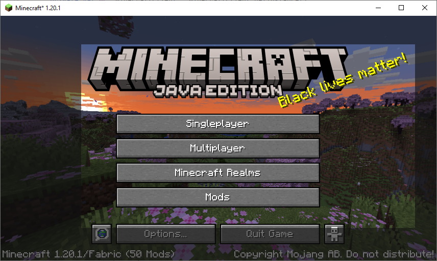
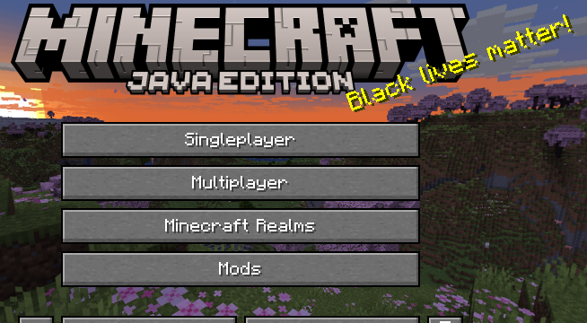

# Screenshots

Screenshots is yet another mod centered around the screenshot functionality in Minecraft.  There
are a few features missing, in my opinion, so I decided to implement them here.

## Settings

### Crop Screenshots
This is the main setting I've seen missing from the other screenshot mods out there. Like the
setting suggests, this setting allows the user to crop screenshots as if they are using snipping
tool on Windows.  Just press F2 like normal, and then drag to select the area you want to
screenshot.

Example Preview

Result

### Pause Game While Cropping
This setting allows for the game to appear to be paused while the cropping HUD is rendered.

### Save Screenshot File
By default, screenshots will save to a file, like normal Minecraft.  However, with this setting
disabled, that will not be the case.

### Copy Screenshot to Clipboard
This setting allows for screenshots to be copied to the clipboard.  This setting should work on
MacOS, but it is untested.  If you run into problems please feel free to
[make an issue](https://github.com/camnwalter/Screenshots/issues/new).

-----

# License
This code is licensed under the MIT License. Information about it can be found inside the file
titled LICENSE.